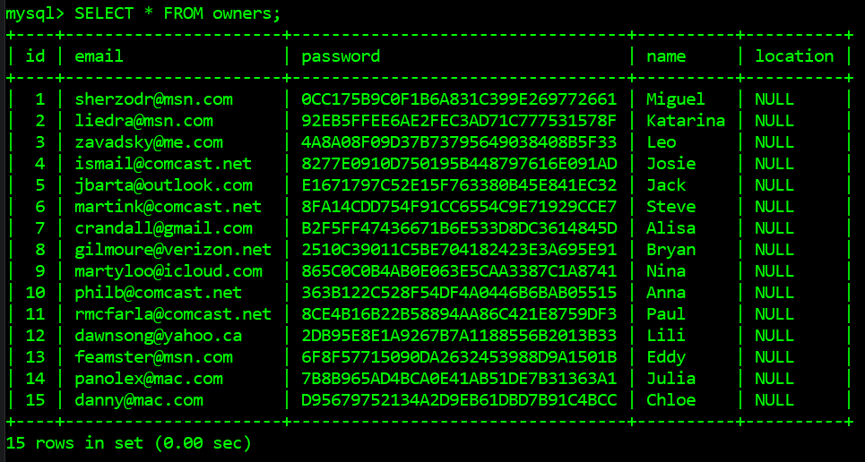
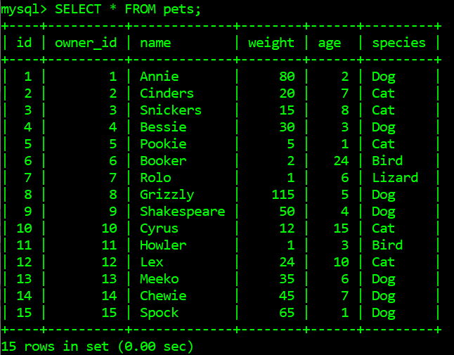
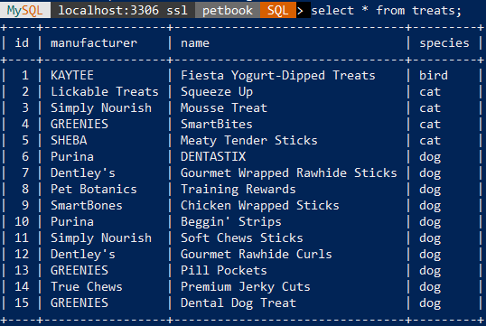

# PetBook

### Team 5

### Elana Olson, Julio Mercado Soto, Lovejit Kharod

---

## Project Overview 
PetBook is an application for pets and pet owners to connect and find friends relative to their location, helping pets find companions to play and socialize with, while helping pet owners meet other pet owners and pets. Owners can search for nearby pet-friendly locations such as parks, common walking routes, and pet play areas. Likewise, one can search for similar species, breeds, size of pet, beloved activities, favorite treats, and other specifications to find the perfect pet companion. Furthermore, nearby pets can be displayed sorted as the best match, weighted appropriately by species, location, and activities.

The stakeholders of our project will be both pets and pet owners.  Owners will be able to arrange meetup appointments with other pet owners in public places to allow their pets to interact and get their much-needed exercise.  PetBook gives owners the ability to meet owners who share a common love for the same species of pet, or even one completely different if they so choose.

## System Environment

Petbook will rely on a three-tiered architecture, built over a MySQL backend. The frontend will be built with Angular and the related HTML and CSS bits and pieces. The two will be connected by a middleware business layer running on Node.js, using Express.js to manage an API, allowing everything to safely and cleanly link together. This will use standard the http client existing within Angular, and the router supplied by Express.js will handle information coming into and going out of the Node backend.

## Functional Requirements
Users of PetBook are pet owners looking for companions and play dates for their pets. Pet owners can connect to other owners in nearby locations to find people that go to the same parks, allowing their pets to socialize and meet new friends. Users can go online to our user-friendly website to search for nearby pets, find pets that connect well with their pet, and befriend other pet owners to arrange activities together.

| Essential          | Desired            | Optional          |
| :----------------- | :----------------- | :----------------- |
| User can oboard and login to register their pet. | Users can sign in using secure password management with bcrypt. Passwords are stored as salted hashes for security purposes. | Each user will be able to have multiple profiles for each pet they would like to register. |
| Pet owner interact with database values through CRUD functionality. | Create a new profile. Read others’ profiles. Update their pet’s profile. Delete their pet’s profile. Profile consists of: Pet name, species, weight, treats, and home location. More fields can be added in the future to be filled in if the user wishes to do so.| Owner can fill information out using Angular forms. |
| Map relationships between pets in a graph-based database. | CRUD on the database is handled by admin. Use multiple tables with foreign keys for significantly different sets of data. | Using MySQL |
| Provide recommendations to pet owners aligning with their pet specifications. | Users will be suggested to meet and connect with other users’ pets with similar specifications. System recommends other pets based on criteria like location and species, with more planned for the future. | Owners will also be given the option to decide what criteria are important in order to meet desired pets. |
| User can friend request other pet owners in order to have their pets connect in the form of playdates or meetups  | User can search for a specific user in order to view their pet’s profile and/or connect with the user. The system sends an email to notify user of friend requests. | Notify owners of changes to friends’ profiles. |

## Nonfunctional Requirements
The GUI will be done using Angular with HTML/CSS to go with it. Angular will also will be used to handle some of the authentication by using route guard to prevent users from accessing management pages for pets that are not their own. Access control will be checked again at the middleware within Node.js as a secondary security measure. The GUI will have the visual benefit of being based on Angular Material, allowing us access to a variety of visual elements that can improve how users will be interacting with the site. A constant sidebar will provide a way for users to easily navigate their pages as well.

To ensure all pet and pet owner data is kept secure, we will use Google sign on to keep their username and password secure and confidential. This approach will allow us to use an established and secure login system to keep user information safe. All pet profile information will be kept confidentially in our database unless the owner specifies it to be shown on their profile, or if the user themselves is logged in. We will also allow users to remove their account and information permanently if they wish to do so.

As for access control, we will prevent against SQL injection and other forms of attack on our database and have a duplicated database to keep information backed up. Database queries will go through a middleware built on Node.js and Express.js that securely interacts with the MySQL database and prevents unwanted database interaction. We will also use Angular route guard to prevent users from accessing pages for which they do not have the correct permissions.

## Database Design

### Explanation for entity sets and relationships:
### Pets 
The database needs to store the data of each pet, holding some attributes to help describe the pet. Pets are weak entity sets so they require an owner.

### Owners
The database needs to store data of the owners of the pets, allowing them to claim ownership of pets and join clubs they may be interested in.

### Parks
Parks will be stored in a database describing their location and if they have a specific species they are targeting, such as a dog park.

### Treats
Pets may have treats that they prefer, and certain parks may have nearby stores that sell some of those treats. This provides another metric owners can use to pick which park they want to visit.

### Clubs
People can be a part of clubs that hold special interests or represent a certain region, so we need to maintain a database of clubs that owners can join.

### Owns (Owner-to-Pet)
All pets registered in our application must have owners, so the database needs to store that information as a relationship.

### Friends (Pet-to-Pet)
One of the primary goals of PetBook is to allow pets to meet and befriend new pets, so our database will store these relationships to facilitate play dates and visits between pets.

### In (Owner-to-Club)
Owners can be in clubs of people that meet together so their pets can interact, so we need to store which clubs an owner has joined.

### Nearby (Owner-to-Park)
Owners can select parks that are near where they live, allowing them to find relevant clubs and other owners, so we store this relationship to the Parks table.

### MeetsAt (Club-to-Park)
Clubs can set up meetings at certain parks, which will be stored in our database as a relationship that can later be expanded to have reccurring meets.

### Likes (Pet-to-Treat) 
To help match pets with new friends and to suggest parks to owners, the database will store which treats have been defined by their owner as something that a given pet likes.

## Relational Schemas
* __bold__ = primary key

owners(__id__, email, password, name, location)

pets(__id__, name, weight, age, species)

clubs(__id__, name, size, species)

parks(__id__, name, location, hours)

treats(__id__, manufacturer, name, species)

pet_pet(__id__, pet1_id, pet2_id)

owner_club(__id__, owner_id, club_id)

owner_park(__id__, owner_id, park_id)

club_park(__id__, club_id, park_id)

pet_treat(__id__, pet_id, treat_id)

## Database Pictures

Owners

Pets

Clubs

Parks

Treats

Pet_Pet

Owner_Club

Club_Parks

Owner_Park

Pet_Treat

